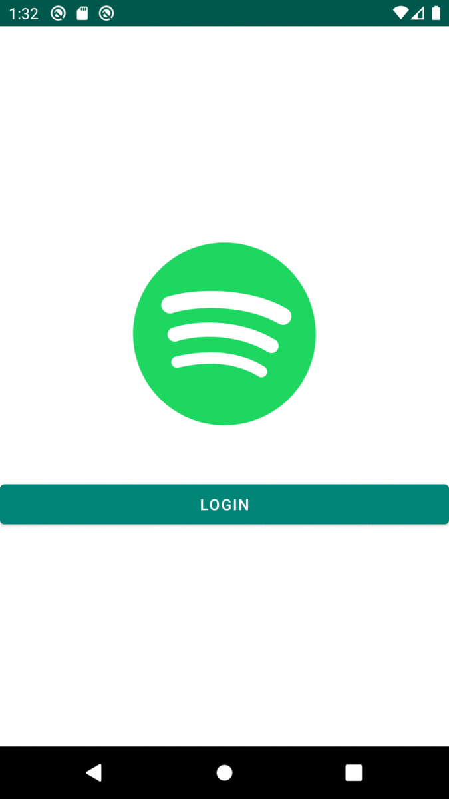
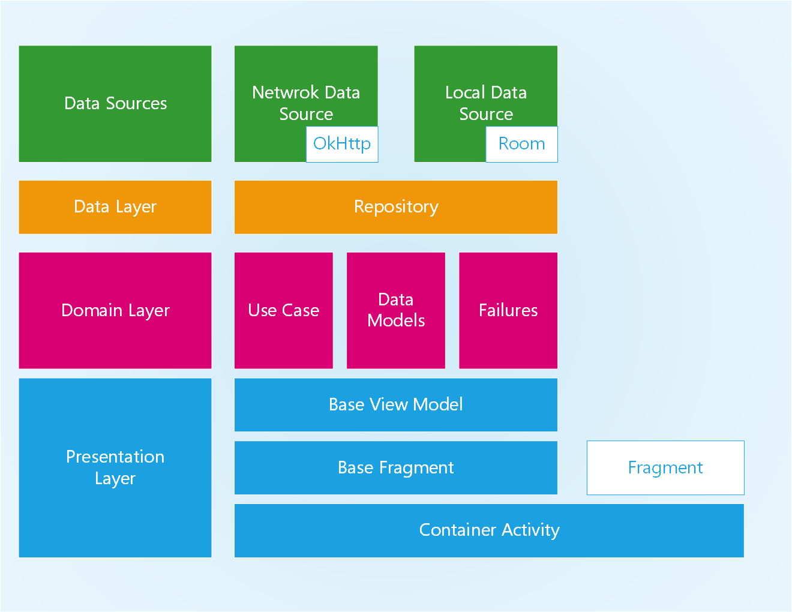

# Spotiapp

Hi there, this is my submission of the task. I have included a copy of the
assignment in `assignment.md` file in this repo.

The release APK of this app is located under releases inside this repo.

You can find it here: https://github.com/MickSawy3r/spotiapp/releases/tag/v1

## Key Modules and Files.

For `OkHttp` Implementation please refer to `common/network` module.
For `Search` Feature Please Refer to app's `feature/search` folder inside the app.

For testing I have written a few unit test (JUnit 4), they are inside the app module. I have few tests for Modules also like the one inside `:common:network` for My `NetworkClient`. 

Thanks in advance for spending time reviewing the code!

## App Working

## Architecture 

For this application I have used clean architecture. However I also implemented a platform abstraction layer.

I have decided to follow Kotlin's Guidelines when it comes to feature folder being inside the app module.

This makes dealing with hilt possible since currently it doesn't fully support feature modules, cuz it inverses the dependency tree and we need Dagger to support that. So, I have included the feature in the app module. and Provided my abstractions on a separate modules (mostly common).

The modules I have written are:

* Common: A common library used for all features. it includes:
     1. Network: 

           ​	An OkHttp Client Implementation

     2. Cache: 

           ​	A Create/Read/Delete abstraction of Room's DAO. It helps to remove some boilerplate code

     3. Extension: 

           ​	Helper Extensions for Everyday life. 2 of those are really interesting: View and Lifecycle

     4. Platform: 

           ​	An Abstraction Layer Over Android's Fragments and Activities, ViewModels and Connectivity Broadcast receiver, with helpful extentions

     5. Reactive: 

           ​	An Abstraction on Reactive Use Cases and Executors

* Authenticator:
      Authentication Manager Lib

* App:
      The Application, with
      

### Feature

For Any Given Feature we have 6 main folders:
   1. Presentation:
        Contains the ViewModel and Fragments (UI)

   2. Domain:
        Contains the Use Cases

   3. Data:
        Contains the Repo

   4. Cache:
        Contains the Feature's Storage Module

   5. Network:
        Contains the Feature's Network Functions

   6. DataSources:

        Contains contracts between repository and data sources

